# MechaCar Statistical Analysis
Module 15 Repository

## Objective and Methodology

Using *R* and *Rstudio*, as well as *R* libraries *dplyr* and *ggplot2*, we conducted several statistical analysis on car performance from data contained in the csv files *MechaCar_mpg.csv* and *Suspension_Coil.csv*. The file *MechaCarChallenge.RScript.R* included in this repository contains the *R* scripts used for our analysis. 

## Deliverable 1 - Linear Regression to Predict MPG

Our first analysis consists of a multiple linear regression using *R*'s *lm()* function to estimate mpg from the following variables:

* vehicle length (*vehicle_length* or *vl* for short)
* vehicle weight (*vehicle_weight* or *vw* for short)
* spoiler angle (*spoiler_angle* or *sa* for short)
* ground_clearance (*ground_clearance* or *gc* for short)
* All-wheel-drive (*AWD*)

The resulting regression formula is:

mpg = 6.267 vl + 0.001245 vw + 0.06877 sa + 3.546 gc - 3.411 AWD - 104.0

The following image shows the resulting *R* linear regression coefficients and their relative weights as well as the intercept.

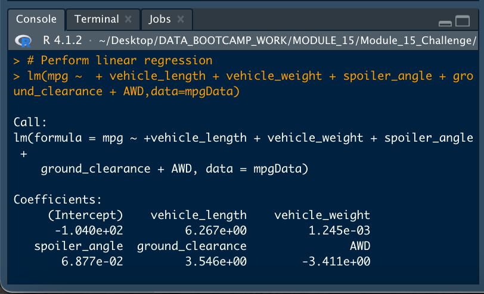

We also ran statistical analysis on the significance of each coefficient in explaining mpg performance. This was done using *R*'s *summary()* function. The following image shows the results:

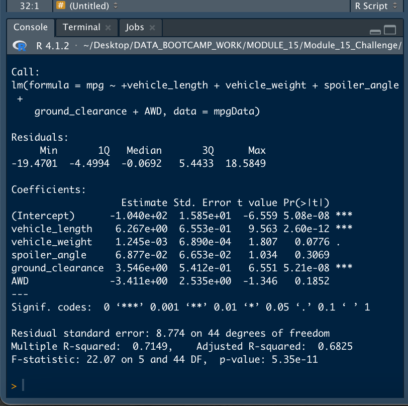

From these results, we can answer the following questions:

* *Which variables/coefficients provided a non-random amount of variance to the mpg values in the dataset?* The variables that provide a non-random amount of variance to the mpg values (as expressed by their low probability in the *Pr>|t| column*) are vehicle length (strong significance) and ground clearance (strong significance) together with the intercept (also strong sinificance), with vehicle weight having a lesser contribution. Spoiler angle and AWD contribute statistically very little to mpg. 

* *Is the slope of the linear model considered to be zero? Why or why not?* The slope of a linear model is the weight of the coefficient. None of the weights reported in our regression summary was equal to zero.

* *Does this linear model predict mpg of MechaCar prototypes effectively? Why or why not?* The *R-squared* value of our linear regression is 0.7149, which means that roughly 71.5% of mpg performance is explained by our regression formula, given a significance level of 0.05% since the *p-value* in the summary statistics resulted in 5.35e-11, which is substantially lower than our significance level.

## Deliverable 2 - Summary Statistics on Suspension Coils

The second statistical analysis we conducted focused on PSI (pounds per square inch) in suspension coils. These coils were manufactured in three batches or lots.

The design specifications for the MechaCar suspension coils dictate that the variance of the suspension coils must not exceed 100 pounds per square inch.

To determine if the manufacturing data meets this design specification, we first conducted summary statistics on the data population, as reported in the following table.

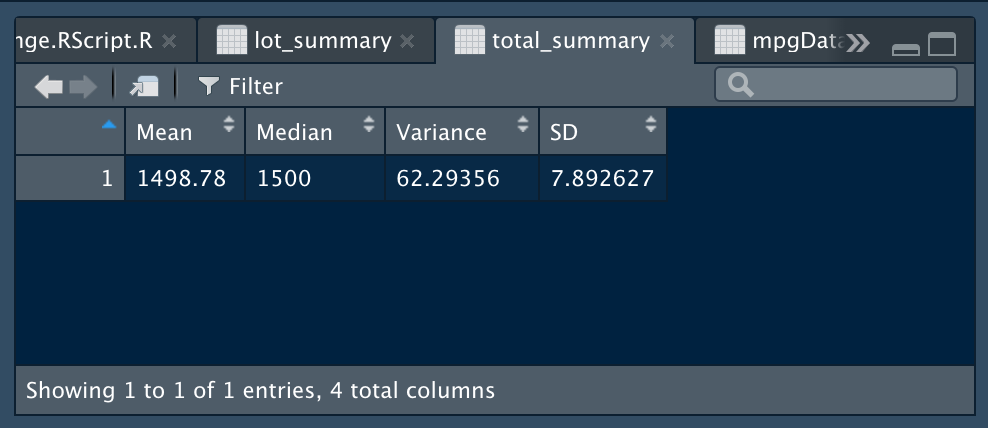

For the whole population, the design specification seems to be met, since the variance reported was 62.29356 psi, a value within the 100 psi specification. However, we also looked at the variance for each lot, to determine whether this held true for each.

The following table presents the summary statistics for each lot:

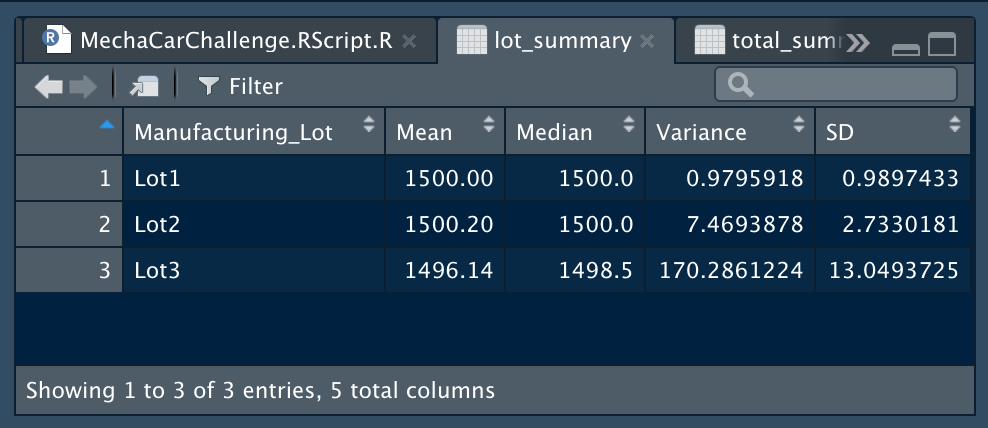

As can be seen, Lot 1 and Lot 2 are meeting the manufacturing specifications, since their reported variance were 0.98 psi and 7.47 psi respectively. Lot 3, on the other hand, reported a variance of 170.29 psi, which is significantly higher than the manufacturing specification of 100 psi. 

Therefore, while the manufacturing data meets this specification for the lots in total, it is not being met by all lots individually. 

The following box plot provides a better appreciation of the statistics for each manufacturing lot, where the wide variability in Lot 3 is evident when compared to Lot 1 and 2. 

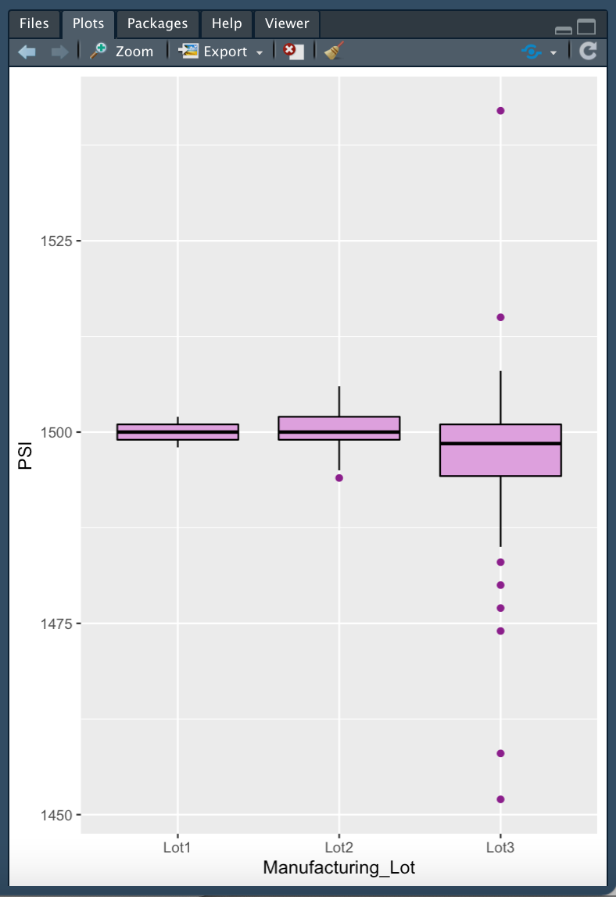

## Deliverable 3 - T-Tests on Suspension Coils

For our third statistical analysis, we used *R*'s *t.test()* function to conduct t-tests to determine if all manufacturing lots and each lot individually are statistically different from the population mean of 1,500 pounds per square inch.

Before conducting the different t-tests, we inspected the data to understand if it conformed to a normal distribution. This was done visually for the whole population as well as for each lot, using *ggplot2*'s *geom_density()* function. We also conducted a Shapiro-Wilk test using *R*'s *shapiro.test()* function on the whole population as well as on each lot. The results are as follows:

### Data for the Whole Population

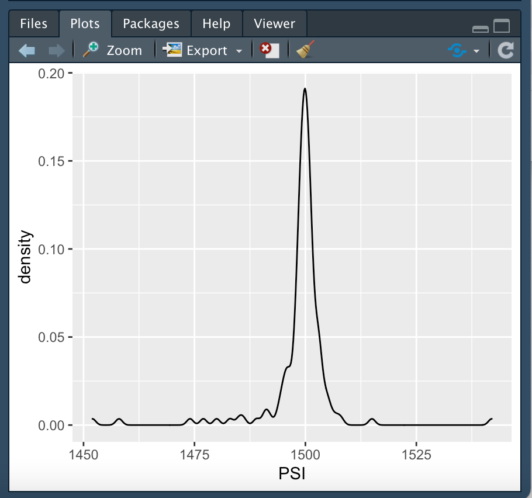

### Data for Lot 1

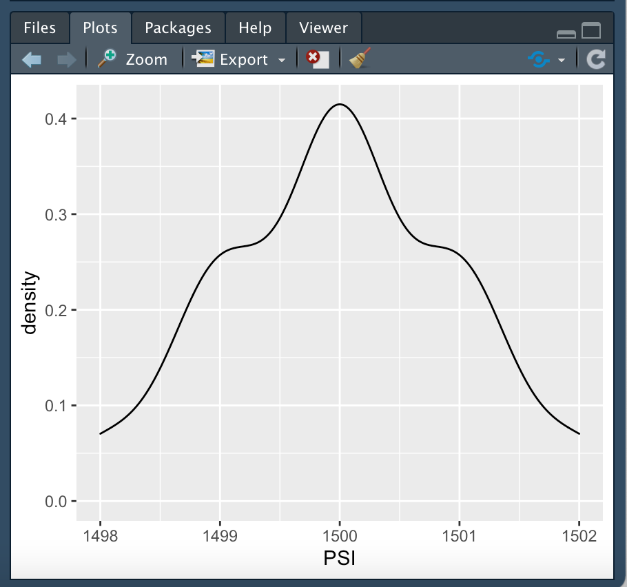

### Data for Lot 2

### Data for Lot 3

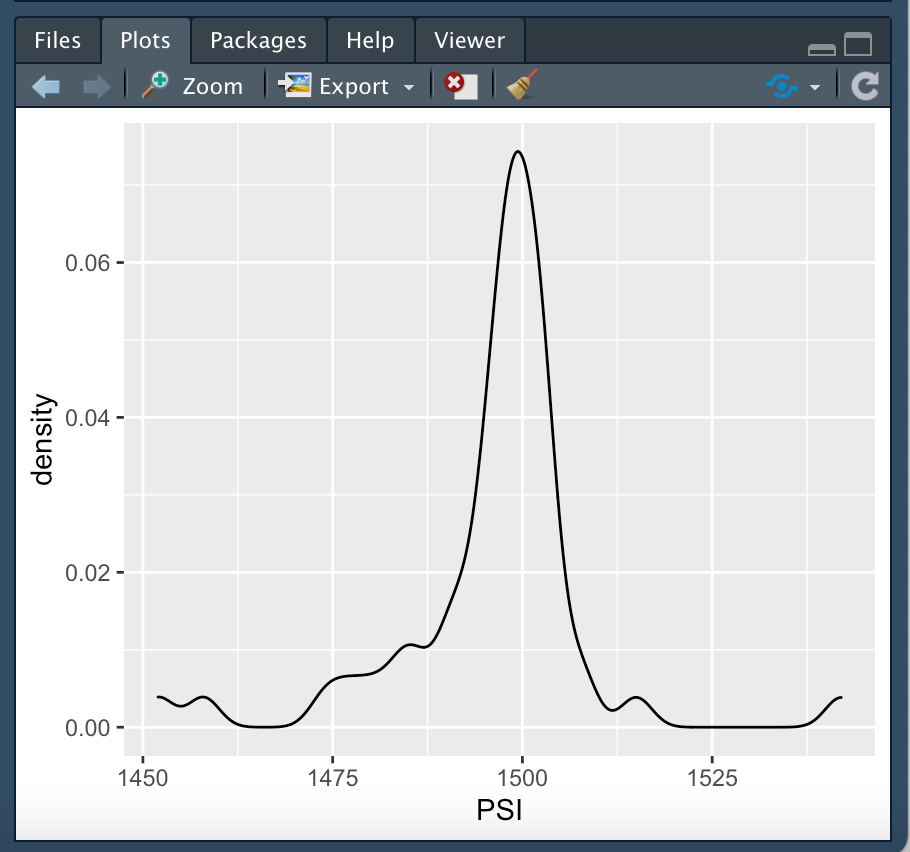

### Shapiro Test for Each Group

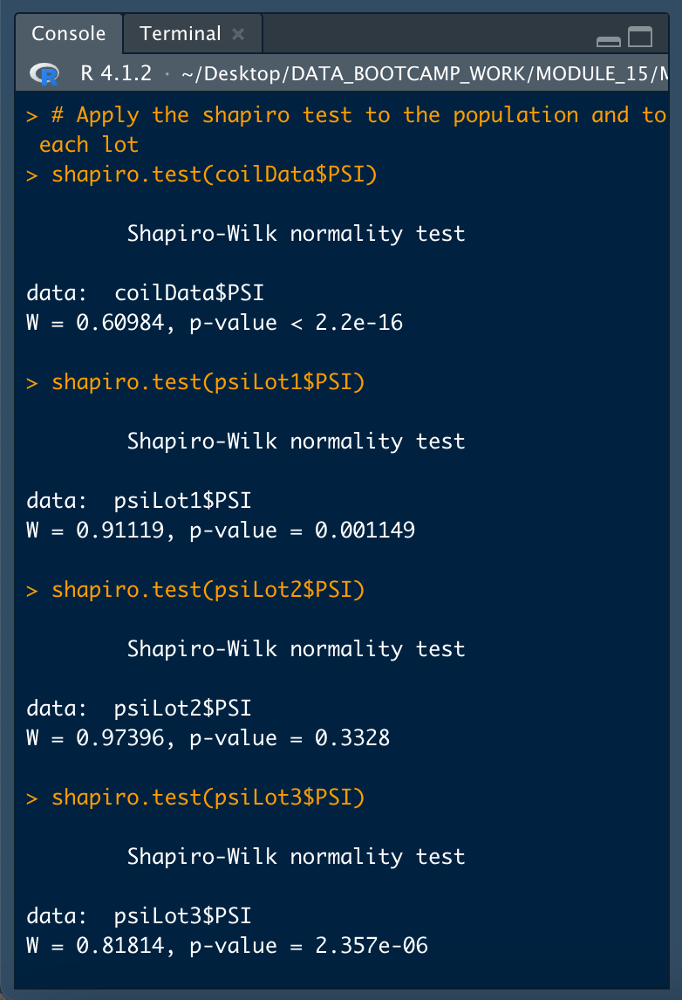

In considering the data, we observed that visually both the whole population, as was well as Lot 2 and Lot 3 have minor skewness. In addition, only Lot 2 has a *p-value* greater than 0.05, thus only Lot 2 would meet our significance level for the Shapiro-Wilks normality test. Since we could not take for granted that all groups were normally distributed, we opted for a minimum sample size greater than 20 when running the one sample t-tests, in order to rely on the *Central Limit Theorem* for normality in the samples (source: https://www.spss-tutorials.com/spss-shapiro-wilk-test-for-normality/). 

The t-tests were conducted for the whole population as well as for each lot using *R*'s *t.test()* function with the *subset* argument. To be on the safe side, a sample size of 30 was used. The following images show the results for the four t-tests.

### T-Test for the Population
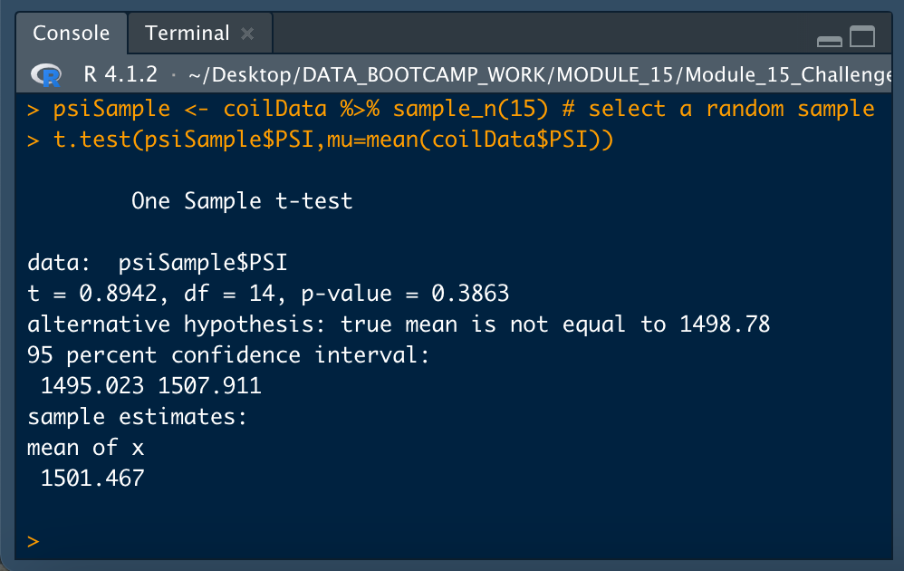

### T-Test for Lot 1

### T-Test for Lot 2
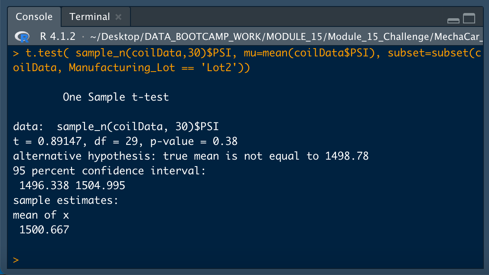

### T-Test for Lot 3
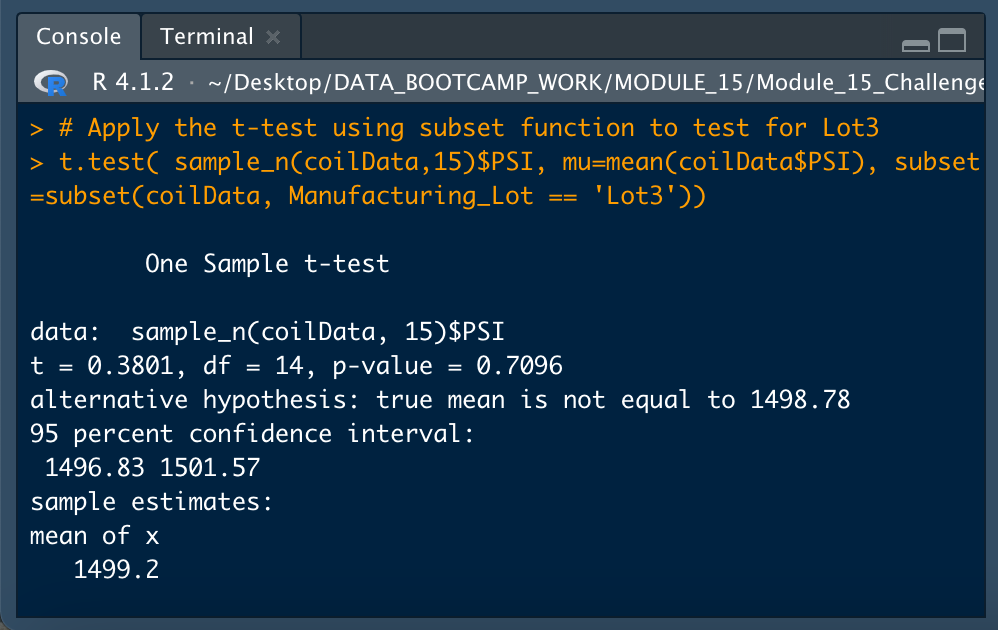

Based on the above t-test results, the true mean of the suspension coil population is 1,498.78 psi. Based on this population mean, Lot 1 shows evidence that the lot mean is different than the mean of the population based on a 95% confidence interval (0.05% significance level) as reported by its p-value less than 0.05. Note that the 95% confidence interval for this Lot is between 1,499.016 and 1,501.650, which is slightly above the 1,498.78 population mean. However, if we were to take 1,500 as the true population mean, then this would not be the case.

As for Lot 2 and 3, the p-values resulting from their respective t-tests were above 0.05 (Lot 2 p-value was 0.38 and Lot 3 was 0.2351). Thus, there is insufficient evidence to reject the hypothesis that their means are different. Thefore, we would state that their means are statistically similar to that of the population.

## Deliverable 4 - Study Design: MechaCar vs Competition

When considering a statistical study to quantify how the MechaCar would perform against the competition, we would need to select metrics that are relevant to consumers. Although aesthetics, comfort and status projection are very important to car owners/operators, these are subjective values that are difficult to measure. A good measure of economic value would be lifetime cost of ownership. This would capture many aspects of owning a car, such as fuel efficiency, reliability, maintenance, price, resale value, etc.. It will also make for a fairer comparison between gasoline cars and new electric alternatives. Cost of ownership can even include recovery costs if the car is used to generate income. 

Several other metrics can be collected to establish which factors most affect lifetime onwership cost (through linear regressions). These could include:

* gallons per 100 miles
* type (electric, hybrid, diesel or gas)
* brand
* engine size (horsepower or cc)
* vehicle weight
* tire size
* brake efficiency
* miles driven
* vibration from road (through potentiometers)

The null hypothesis of our test would be that lifetime ownership cost is no different between MechaCar and the competition, while the alternative hypothesis would be that the MechaCar's lifetime ownership cost is different.

We would conduct one-sided t-tests with the alternative hypothesis being that MechaCar's lifetime operating cost is less than that of the competition. We would also conduct linear regression on the different factors to determine which factors contribute most to lifetime operating costs.

Write a short description of a statistical study that can quantify how the MechaCar performs against the competition. In your study design, think critically about what metrics would be of interest to a consumer: for a few examples, cost, city or highway fuel efficiency, horse power, maintenance cost, or safety rating.

In your description, address the following questions:

* What metric or metrics are you going to test?
* What is the null hypothesis or alternative hypothesis?
* What statistical test would you use to test the hypothesis? And why?
* What data is needed to run the statistical test?
