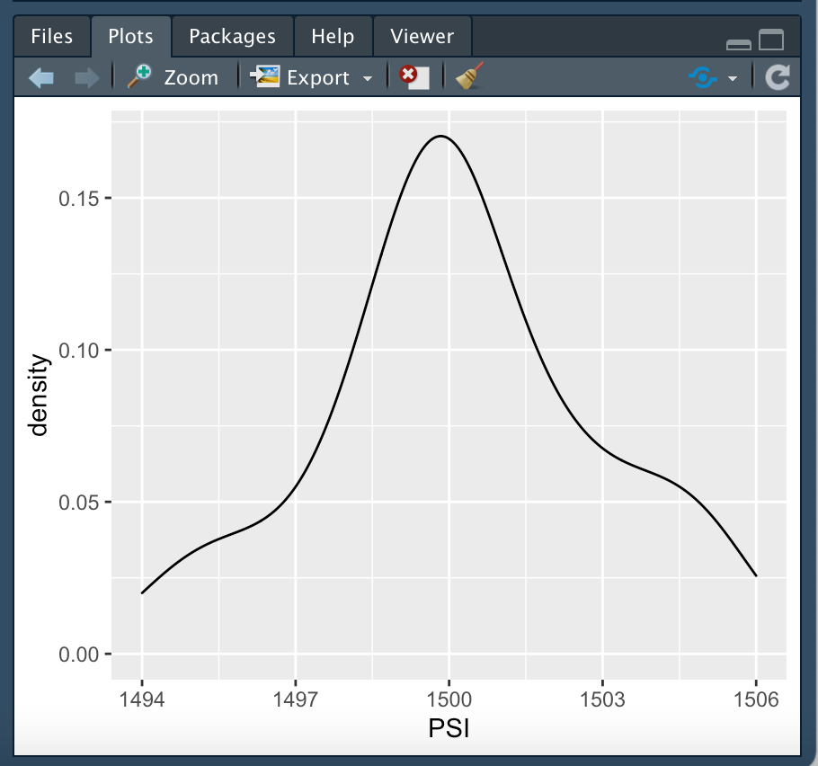
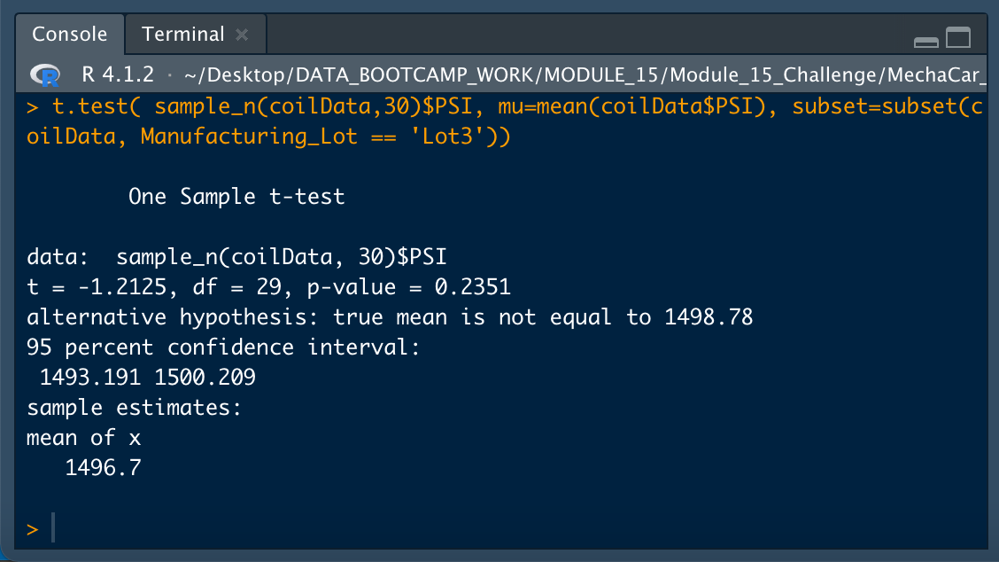

# MechaCar Statistical Analysis
Module 15 Repository

## Objective and Methodology

Using *R* and *Rstudio*, as well as *R* libraries *dplyr* and *ggplot2*, we conducted several statistical analysis on car performance from data contained in the csv files *MechaCar_mpg.csv* and *Suspension_Coil.csv*. The file *MechaCarChallenge.RScript.R* included in this repository contains the *R* scripts used for our analysis. 

## Deliverable 1 - Linear Regression to Predict MPG

Our first analysis consists of a multiple linear regression using *R*'s *lm()* function to estimate mpg from the following variables:

* vehicle length (*vehicle_length* or *vl* for short)
* vehicle weight (*vehicle_weight* or *vw* for short)
* spoiler angle (*spoiler_angle* or *sa* for short)
* ground_clearance (*ground_clearance* or *gc* for short)
* All-wheel-drive (*AWD*)

The resulting regression is:

mpg = 6.267 vl + 0.001245 vw + 0.06877 sa + 3.546 gc - 3.411 AWD - 104.0

The following image shows the resulting *R* linear regression coefficientes and their relative weights as well as the intercept.

We also ran statistical analysis on the significance of each coefficient in explaining mpg performance. This was done using *R*'s *summary()* function. The following image shows the results:

From these results, we can answer the following questions:

* *Which variables/coefficients provided a non-random amount of variance to the mpg values in the dataset?* The variables that provide a non-random amount of variance to the mpg values (as expressed by their low probability in the *Pr>|t| column*) are vehicle length (strong significance) and ground clearance (strong significance) together with the intercept (also strong sinificance), with vehicle weight having a lesser contribution. Spoiler angle and AWD contribute statistically very little to mpg. 

* *Is the slope of the linear model considered to be zero? Why or why not?* The slope of a linear model is the weight of the coefficient. None of the weights reported in our regression summary was equal to zero.

* *Does this linear model predict mpg of MechaCar prototypes effectively? Why or why not?* The *R-squared* value of our linear regression is 0.7149, which means that roughly 71.5% of mpg performance is explained by our regression formula, given a significance level of 0.05% since the *p-value* in the summary statistics resulted in 5.35e-11, which is substantially lower than our significance level.

## Deliverable 2 - Summary Statistics on Suspension Coils

* The design specifications for the MechaCar suspension coils dictate that the variance of the suspension coils must not exceed 100 pounds per square inch. Does the current manufacturing data meet this design specification for all manufacturing lots in total and each lot individually? Why or why not?

## Deliverable 3 - T-Tests on Suspension Coils

## Deliverable 4 - Study Design: MechaCar vs Competition

Write a short description of a statistical study that can quantify how the MechaCar performs against the competition. In your study design, think critically about what metrics would be of interest to a consumer: for a few examples, cost, city or highway fuel efficiency, horse power, maintenance cost, or safety rating.

In your description, address the following questions:

* What metric or metrics are you going to test?
* What is the null hypothesis or alternative hypothesis?
* What statistical test would you use to test the hypothesis? And why?
* What data is needed to run the statistical test?
